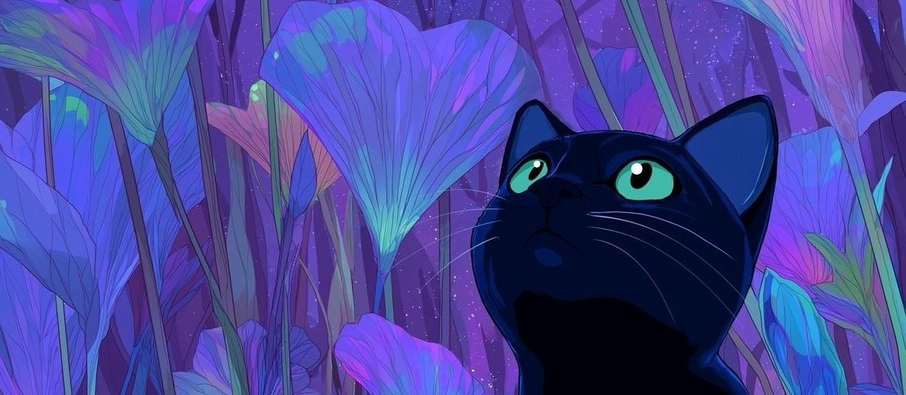

 

**`Desenvolvedora Front-End em Formação`**

 

  Atualmente curso o Técnico em Desenvolvimento de Sistemas e tenho me dedicado aos estudos de desenvolvimento Front-End. Busco aprimorar meus conhecimentos por meio de projetos práticos, sempre procurando aprender novas tecnologias e desenvolver soluções criativas e funcionais.

Atualmente estudo HTML, CSS, JavaScript, React, Python e outras ferramentas para desenvolvimento, com o objetivo de evoluir constantemente e construir experiências digitais de qualidade.

 

#

### My Stack

  

###  GitHub Stats

 

##

<picture>
  <source media="(prefers-color-scheme: dark)" srcset="https://raw.githubusercontent.com/GabriellySantos00/GabriellySantos00/output/pacman-contribution-graph-dark.svg">
  <source media="(prefers-color-scheme: light)" srcset="https://raw.githubusercontent.com/GabriellySantos00/GabriellySantos00/output/pacman-contribution-graph.svg">
  
</picture>

