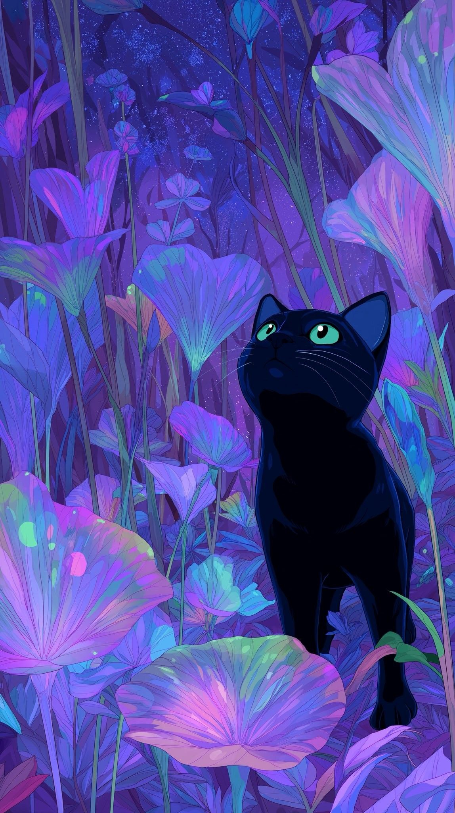

<table>
<tr>

<td width="62%" valign="middle">

 

**`Desenvolvedora Front-End em Formação`**

 

  Atualmente curso Desenvolvimento de Sistemas e tenho me dedicado aos estudos de desenvolvimento Front-End. Busco aprimorar meus conhecimentos por meio de projetos práticos, sempre procurando aprender novas tecnologias e desenvolver soluções criativas e funcionais.

Atualmente estudo HTML, CSS, JavaScript, React, Python e outras ferramentas para desenvolvimento, com o objetivo de evoluir constantemente e construir experiências digitais de qualidade.

  

</td>

<td width="40%" align="center">

</td>

</tr>
</table>

## Linguagens e Tecnologias

## Atualmente estudando

- ⚡ JavaScript
- ⚛️ React
- 🎨 UX/UI Design
- 🏛️ Arquitetura de Software

## Estatísticas

***

<picture>
  <source media="(prefers-color-scheme: dark)" srcset="https://raw.githubusercontent.com/GabriellySantos00/GabriellySantos00/output/pacman-contribution-graph-dark.svg">
  <source media="(prefers-color-scheme: light)" srcset="https://raw.githubusercontent.com/GabriellySantos00/GabriellySantos00/output/pacman-contribution-graph.svg">
  
</picture>

